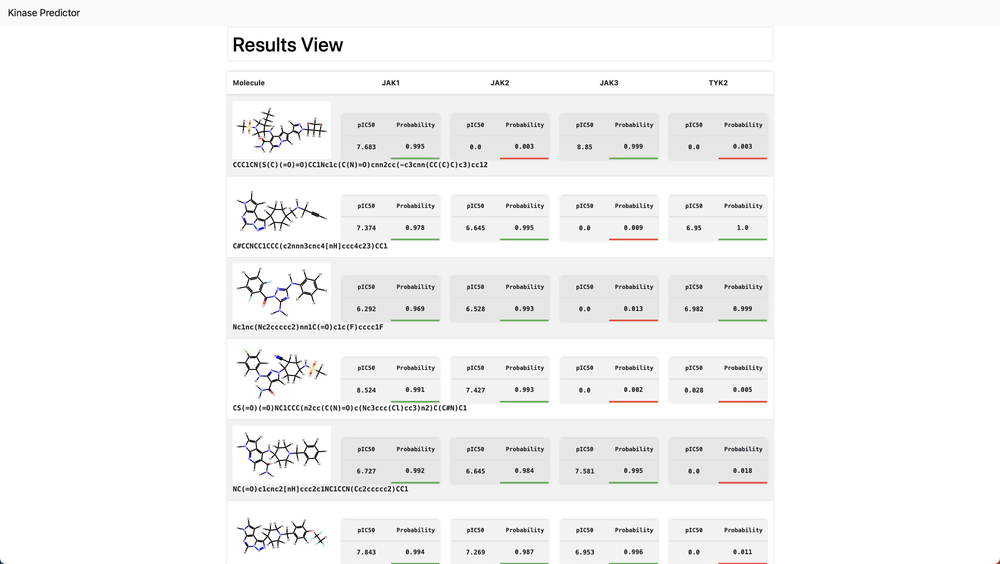

# Flask Web App 

To launch the webapp: 
```bash 
python webapp/app.py 
```

Predictions can be made using the frontend or the API. 

For using the api, launch the server and then send the following POST request: 
```bash
curl -X POST http://127.0.0.1:5000/api_predict -d "smiles=[INSERT SMILES]"
```
With [INSERT SMILES] being the SMILES string of the molecule you want to predict the pIC50 value for.
 _Currently only supports one molecule prediction at a time_

The api endpoint will return a JSON object with the predicted pIC50 values and probabilities for each target.

For using the frontend, it can accept a SMILES string or a _.smi_ file of SMILES strings separated by newlines.

This web app model is easily transferrable to another hosting service such as Heroku or AWS. It also demonstrates how versatile it can be as a frontend service for more visual explorations, or as a backend service for rapid predictions.

<!-- Add image from ../images/kinpred -->
